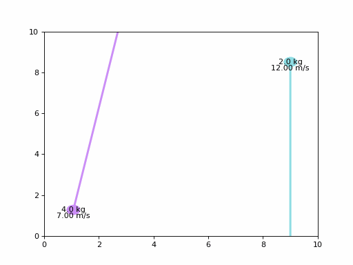

# Задание к лекции №4
### Задание
>Визуализация абсолютно упругого нецентрального соударения двух тел с разными массами. Тела находятся в ограниченной прямоугольной оболочке, соударения с оболочкой также считать абсолютно упругим.
> - *Входные параметры:* массы тел, начальные скорости (модуль, направление), размеры оболочки.
> - *Итоговый вид модели:* динамическое соударение тел друг с другом и с оболочкой.

## Теоретический материал
***Абсолютно упругий удар:***
- это тип соударения, при котором выполняется закон сохранения энергии и закон сохранения импульса.
- это модель соударения, при которой полная кинетическая энергия системы сохраняется. В классической механике при этом пренебрегают деформациями тел. Соответственно, считается, что энергия на деформации не теряется, а взаимодействие распространяется по всему телу мгновенно. 


**1. Сохранение импульса:**  
В замкнутой системе сумма импульсов до и после столкновения остается неизменной:
$m_1 \vec{v}_1 + m_2 \vec{v}_2 = m_1 \vec{v}_1' + m_2 \vec{v}_2'$
где:
- $m_1$ и $m_2$ — массы тел,
- $\vec{v}_1$ и $\vec{v}_2$ — скорости тел до столкновения,
- $\vec{v}_1'$ и $\vec{v}_2'$ — скорости тел после столкновения.

**2. Сохранение кинетической энергии:**  
В абсолютно упругом столкновении суммарная кинетическая энергия также сохраняется:
$$\frac{1}{2} m_1 |\vec{v}_1|^2 + \frac{1}{2} m_2 |\vec{v}_2|^2 = \frac{1}{2} m_1 |\vec{v}_1'|^2 + \frac{1}{2} m_2 |\vec{v}_2'|^2$$

**3. Закон сохранения для упругого соударения двух тел:**  
Для вычисления скоростей тел после столкновения используется следующие формулы:
- $$\vec{v}_1' = \vec{v}_1 - \frac{2 m_2}{m_1 + m_2} \left( \frac{(\vec{v}_1 - \vec{v}_2) \cdot \vec{n}}{\vec{n} \cdot \vec{n}} \right) \vec{n} \$$
- $$\vec{v}_2' = \vec{v}_2 + \frac{2 m_1}{m_1 + m_2} \left( \frac{(\vec{v}_1 - \vec{v}_2) \cdot \vec{n}}{\vec{n} \cdot \vec{n}} \right) \vec{n}$$
  
где:
+ $\vec{n}$ — единичный вектор нормали к плоскости столкновения, направленный от одного тела к другому,
+ $(\vec{v}_1 - \vec{v}_2) \cdot \vec{n}$ — скалярное произведение, которое вычисляет проекцию скорости на направление нормали.

---

## Описание параметров модели

**Входные данные:**
1. Масса первого тела $m_1$, кг.
2. Масса второго тела $m_2$, кг.
3. Модуль скорости первого тела $|\vec{v}_1| \$, м/с.
4. Модуль скорости второго тела $|\vec{v}_2| \$, м/с.
5. Направление скорости первого тела вектор $(x, y \$).
6. Направление скорости второго тела вектор $(x, y \$).
7. Размеры ограничивающей оболочки — ширина и высота.

**Начальные условия:**
- Направление скорости нормализуется и умножается на модуль, чтобы получить начальные векторы скоростей.
- Позиции тел выбираются так, чтобы тела не пересекались в начальный момент времени.

---

## Функции

### `resolve_collision(v1, v2, m1, m2, pos1, pos2)`
Функция вычисляет скорости тел после столкновения. Она использует уравнения сохранения импульса и кинетической энергии, а также вычисляет направление нормали к плоскости столкновения.

```python
def resolve_collision(v1, v2, m1, m2, pos1, pos2):
    normal = (pos2 - pos1) / np.linalg.norm(pos2 - pos1)
    p = 2 * (v1 @ normal - v2 @ normal) / (m1 + m2)
    v1_new = v1 - p * m2 * normal
    v2_new = v2 + p * m1 * normal
    return v1_new, v2_new
   ```

### `update_positions()`
Функция обновляет позиции тел и проверяет столкновения со стенками оболочки. При столкновении тела с границей компонента скорости, направленная перпендикулярно к стенке, меняется на противоположную, обеспечивая абсолютно упругое столкновение.
```python
def update_positions():
    global positions, velocities

    for i in range(2):
        positions[i] += velocities[i] * time_step

        #Соударение с оболочкой
        if positions[i][0] <= 0 or positions[i][0] >= box_width:
            velocities[i][0] = -velocities[i][0]
        if positions[i][1] <= 0 or positions[i][1] >= box_height:
            velocities[i][1] = -velocities[i][1]

    #Соударение между телами
    distance = np.linalg.norm(positions[0] - positions[1])
    if distance < 0.5:  # Радиус каждого объекта = 0.25
        velocities[0], velocities[1] = resolve_collision(
            velocities[0], velocities[1], masses[0], masses[1], positions[0], positions[1]
        )
```

### Визуализация
Для визуализации используется `matplotlib`. Каждый кадр обновляет положения тел, их направления и отображает текущие скорости.

### Пример работы 
***Входные данные:***
1. Масса первого тела $4$, кг.
2. Масса второго тела $2$, кг.
3. Модуль скорости первого тела $|7| \$, м/с.
4. Модуль скорости второго тела $|12| \$, м/с.
5. Направление скорости первого тела вектор $(1, 4 \$).
6. Направление скорости второго тела вектор $(0, -3 \$).
7. Размеры ограничивающей оболочки — 10 × 10 условных единиц.

***Результат***


### Источники теоретического материала
- [99 баллов](https://lk.99ballov.ru/wiki/physics/Absolyutno_uprugii_i_absolyutno_neuprugii_udar)
- [Ассоциация победителей олимпиад](https://xn--80a2ac.xn--p1ai/%D0%BC%D0%B0%D1%82%D0%B5%D1%80%D0%B8%D0%B0%D0%BB%D1%8B/%D1%81%D0%BE%D1%83%D0%B4%D0%B0%D1%80%D0%B5%D0%BD%D0%B8%D1%8F-%D1%87%D0%B0%D1%81%D1%82%D1%8C-2/)
- [Wikipedia](https://ru.wikipedia.org/wiki/%D0%A3%D0%B4%D0%B0%D1%80#%D0%90%D0%B1%D1%81%D0%BE%D0%BB%D1%8E%D1%82%D0%BD%D0%BE_%D1%83%D0%BF%D1%80%D1%83%D0%B3%D0%B8%D0%B9_%D1%83%D0%B4%D0%B0%D1%80)
